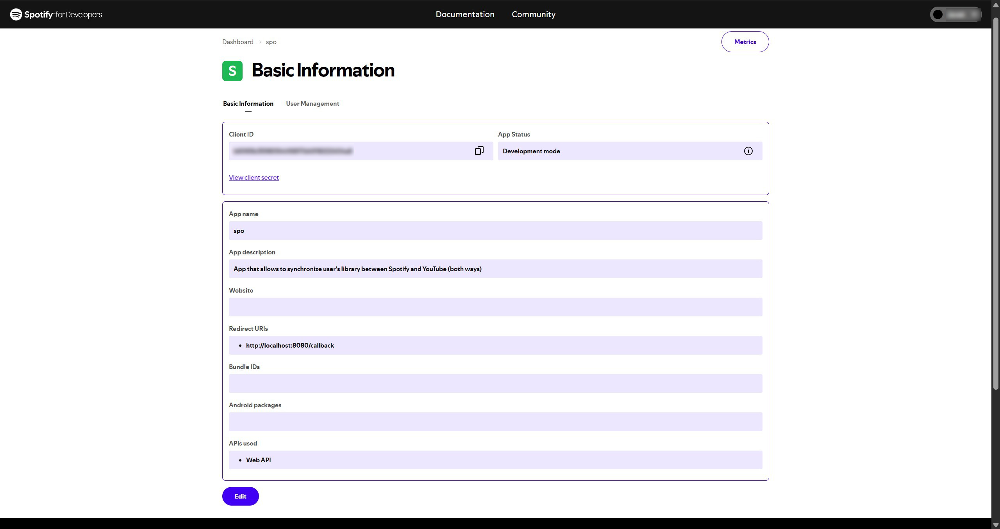

# SPO - Spotify to YouTube Music Sync

A comprehensive Python tool for synchronizing playlists between Spotify and YouTube Music with built-in API rate limiting and throttling.

## Features

- **Spotify Integration**: Secure authentication with automatic and manual fallback modes
- **API Rate Limiting**: Advanced throttling mechanism to prevent rate limit violations
- **Graceful Error Handling**: Automatic retries with exponential backoff for failed requests
- **User-Friendly**: Simple setup with environment variable configuration
- **Robust Authentication**: Handles token refresh and authentication errors automatically

## Quick Start

### Installation

```bash
# Clone the repository
git clone git@github.com:kodzonko/spo.git
cd spo

# Install dependencies
uv pip install -e .
```

### Configuration

Create a web application on the [Spotify Developer Dashboard](https://developer.spotify.com/dashboard/applications) to obtain your client ID and secret. As per instructions: [Getting started with Web API](https://developer.spotify.com/documentation/web-api/tutorials/getting-started)

The app dashboars should look like this:

<p align="center">
  
</p>

Create an `.env` file in the project root:

```env
SPOTIFY_CLIENT_ID=your_spotify_client_id
SPOTIFY_CLIENT_SECRET=your_spotify_client_secret
SPOTIFY_REDIRECT_URI=http://localhost:8080/callback
```

### Basic Usage

```python
from spo.spotify_client import SpotifyClient

# Initialize client with automatic throttling
with SpotifyClient() as client:
    # Search for tracks (automatically throttled)
    tracks = client.search_tracks("Bohemian Rhapsody", limit=10)

    # Get user playlists (automatically throttled)
    playlists = client.get_user_playlists(limit=20)

    # Get saved tracks (automatically throttled)
    saved_tracks = client.get_user_saved_tracks(limit=50)
```

## API Rate Limiting

This project includes a sophisticated throttling mechanism that prevents API rate limit violations and handles rate limits gracefully.

### Key Features

- **Token Bucket Algorithm**: Handles burst requests efficiently
- **Sliding Window**: Enforces per-minute rate limits
- **Exponential Backoff**: Automatic retry with increasing delays
- **Spotify Optimization**: Pre-configured limits optimized for Spotify's API
- **Transparent Integration**: No code changes required - just add decorators

### How It Works

All Spotify API methods are automatically decorated with `@spotify_throttle()`, which:

1. **Prevents Rate Limits**: Limits requests to 0.5/second and 30/minute by default
2. **Handles 429 Responses**: Automatically retries with proper delays
3. **Manages Bursts**: Allows up to 5 rapid requests before throttling
4. **Logs Activity**: Provides detailed logging for monitoring and debugging

### Example Output

```
🔍 Search 1/5: 'Bohemian Rhapsody'
   ✅ Found 3 tracks in 0.45s
🔍 Search 2/5: 'Billie Jean'
   ✅ Found 3 tracks in 2.12s  # Rate limited - waited before request
🔍 Search 3/5: 'Hotel California'
   ✅ Found 3 tracks in 2.08s
```

## Advanced Usage

### Custom Throttling

```python
from spo.throttling import throttle, spotify_throttle

# Custom rate limits
@throttle(requests_per_second=1.0, max_retries=3)
def custom_api_call(self):
    return self._spotify.some_endpoint()

# Spotify-optimized throttling
@spotify_throttle(requests_per_minute=20)
def conservative_api_call(self):
    return self._spotify.another_endpoint()
```

### Error Handling

```python
try:
    tracks = client.search_tracks("query")
except spotipy.SpotifyException as e:
    if e.http_status == 429:
        print("Rate limited (should be handled automatically)")
    elif e.http_status == 401:
        print("Authentication error")
    else:
        print(f"API error: {e}")
```

## Testing

Run the test suite:

```bash
# Run all tests
python -m pytest tests/

# Run throttling tests specifically
python -m pytest tests/test_throttling.py -v

# Run demo
python -m spo.demo_throttling
```

## Documentation

- [Throttling Mechanism](docs/throttling.md) - Detailed documentation of the rate limiting system
- [API Reference](docs/) - Complete API documentation

## Project Structure

```
spo/
├── src/spo/
│   ├── __init__.py
│   ├── main.py                 # Main application entry point
│   ├── spotify_client.py       # Spotify API client with throttling
│   ├── throttling.py           # Rate limiting and retry logic
│   ├── auth_server.py          # Authentication server
│   └── demo_throttling.py      # Throttling demonstration
├── tests/
│   └── test_throttling.py      # Throttling mechanism tests
├── docs/
│   └── throttling.md           # Detailed throttling documentation
└── README.md
```

## Contributing

1. Fork the repository
2. Create a feature branch
3. Add tests for new functionality
4. Ensure all tests pass
5. Submit a pull request

## License

This project is licensed under the MIT License.
